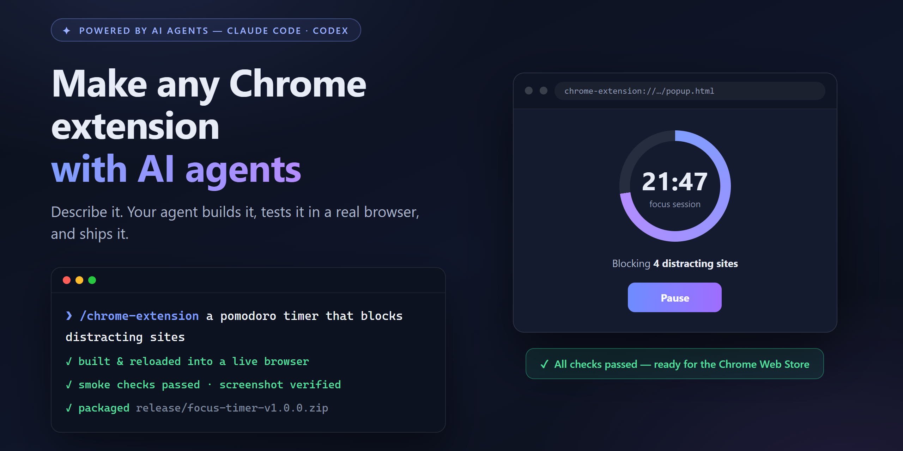
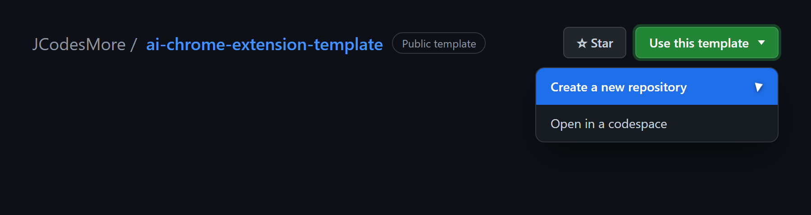
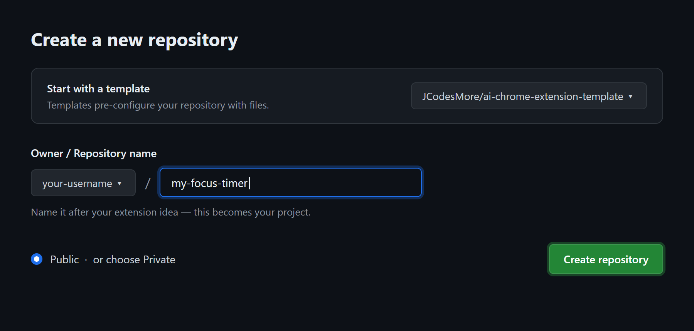

<div align="center">

# AI Chrome Extension Template

### Describe it. Your AI agent builds it, tests it, and ships it.

Ever wanted your own Chrome extension but didn't want to learn extension development?
Now you don't have to. Tell your AI agent what you want — it plans the build, writes the
code, tests it in a real browser it controls by itself, fixes its own mistakes, and hands
you a finished extension ready for the Chrome Web Store.

[](https://discord.gg/hrTSX5yTpB)

<a href="https://github.com/JCodesMore/ai-chrome-extension-template/blob/main/LICENSE"></a> <a href="https://github.com/JCodesMore/ai-chrome-extension-template/stargazers"></a>

[Quick Start](#quick-start) · [What to ask for](#what-to-ask-for) · [How it works](#how-it-works) · [Publishing](#publishing-to-the-chrome-web-store)

</div>

---



## Quick Start

> **Important:** don't clone this template repo directly. Make your own copy with
> GitHub's **Use this template** button — that way your extension (and everything your
> AI agent commits, pushes, and releases) lives in _your_ repository. Pull requests
> opened against this template with generated extensions will be closed.

**1. Click "Use this template" → "Create a new repository"**

At the top of [this repo's page](https://github.com/JCodesMore/ai-chrome-extension-template),
signed in to GitHub (the button is hidden when signed out — accounts are free):



**2. Name it and create it**

Name it after your idea, keep **Public** (or choose Private), and click
**Create repository**:



**3. Open your new repository on your computer**

Clone it with [GitHub Desktop](https://desktop.github.com/), or in a terminal:

```bash
git clone https://github.com/YOUR-USERNAME/YOUR-NEW-REPOSITORY.git
cd YOUR-NEW-REPOSITORY
```

**4. Start your AI agent in that folder** — [Claude Code](https://docs.anthropic.com/en/docs/claude-code) recommended:

```bash
claude
```

**5. Tell it what you want:**

```
/chrome-extension a pomodoro timer that blocks distracting sites during focus sessions
```

**That's it.** The agent handles everything else — installing dependencies, downloading
its own private test browser, planning the build, coding, testing, and fixing until it
works. It may ask you a question or two up front, then it gets to work. When it's done
you'll have a working extension, screenshots to prove it, and a zip file ready for the
Chrome Web Store.

> First-time notes: you'll need [Node.js](https://nodejs.org/) 22+ installed (one-time,
> free) and an AI coding agent. Using Codex instead of Claude Code? It works out of the
> box too — see [Supported agents](#supported-ai-agents) below.

## What to ask for

Anything you can describe, really:

- _"A pomodoro timer that blocks distracting sites during focus sessions."_
- _"Save any page to a reading list with one click, so I can get through it later."_
- _"Hide YouTube Shorts and recommendations so I stop doomscrolling."_
- _"Group my open tabs by site and close all the duplicates."_
- _"A new-tab page that shows my top 3 todos and nothing else."_
- _"Copy the current page as a clean Markdown link for my notes."_

The agent turns your words into a plan, asks about anything genuinely ambiguous, and
builds the simplest version that does the job — then you can keep asking for more:
_"add a daily stats page"_, _"make it dark mode"_, _"ship it"_.

## How it works

The magic is a closed feedback loop — the same setup used to build and ship a real
production extension:

1. **Plan** — your idea becomes a spec and a step-by-step build plan
2. **Build** — the agent writes the code, one small verified step at a time
3. **Test for real** — it loads your extension into its own private browser, clicks
   around, reads the error logs, and takes screenshots to check its own work
4. **Fix and repeat** — every error is caught and traced to the exact change that caused
   it, so the agent fixes things without your help
5. **Package** — a store-ready zip, icons, screenshots, and listing text are generated
6. **Ship** — a versioned GitHub release if you want one, plus simple instructions for
   the Chrome Web Store

Your own Chrome is never touched — the agent downloads an isolated
[Chrome for Testing](https://developer.chrome.com/blog/chrome-for-testing) just for
development (~280 MB, one time).

## Publishing to the Chrome Web Store

Optional, and the agent preps everything: the zip, the description, the screenshots, and
the permission justifications. You just create a developer account (one-time $5 fee),
upload the zip, and paste in the text. [docs/chrome-web-store.md](docs/chrome-web-store.md)
walks you through it click by click — most people are done in under 15 minutes.

## Supported AI agents

| Agent                                                         | Status          |
| ------------------------------------------------------------- | --------------- |
| [Claude Code](https://docs.anthropic.com/en/docs/claude-code) | **Recommended** |
| [Codex CLI](https://github.com/openai/codex)                  | Supported       |

Codex picks up `AGENTS.md` automatically and finds the same skill under
`.agents/skills/` — see [docs/codex-setup.md](docs/codex-setup.md) for sandbox notes.
Other agents that read `AGENTS.md` and the open [Agent Skills](https://agentskills.io)
standard will mostly work, but only the two above are tested.

<details>
<summary><b>The commands under the hood</b></summary>

The agent drives these for you, but they're all yours to run too:

```bash
npm run browser   # launch the agent's dev browser (isolated profile + CDP)
npm run reload    # build + reload the extension, failing loudly on load errors
npm run smoke     # end-to-end smoke checks + popup screenshot
npm run gate      # format check + lint + typecheck + unit tests
npm run package   # build a Chrome-Web-Store-ready zip into release/
npm run release -- patch|minor|major   # version bump + tag + GitHub release
npm run stop      # close the dev browser
```

Environment overrides: `CDP_PORT` (default 9222), `BROWSER_EXE` (use your own
Chromium-family build instead of downloading Chrome for Testing).

</details>

<details>
<summary><b>Project structure</b></summary>

```
src/                  # TypeScript extension source (strict mode)
  background.ts       # MV3 service worker
  popup/              # popup UI
  lib/                # pure, unit-tested logic
public/               # manifest.json + static pages, copied into the build
tools/                # the dev loop: browser launch, CDP, reload, smoke, package, release
docs/                 # runbooks the agent loads on demand + docs it maintains for you
.claude/skills/       # the /chrome-extension skill (source of truth)
.agents/, .codex/     # generated skill copies for Codex (npm run sync)
AGENTS.md             # agent operating manual (all agents)
CLAUDE.md             # Claude Code config (imports AGENTS.md)
```

</details>

<details>
<summary><b>Why Chrome for Testing instead of my installed Chrome?</b></summary>

Google removed the ability to side-load unpacked extensions from regular Chrome and Edge
in 2025 (v137+). [Chrome for Testing](https://developer.chrome.com/blog/chrome-for-testing)
is Google's own automation build of the exact same browser, with side-loading intact —
it's the officially recommended vehicle for this. The agent fetches it once into a
gitignored `.browser/` folder and runs it with a fully isolated profile, so your personal
browser, profiles, and data are never involved.

</details>

<details>
<summary><b>Not intended for</b></summary>

- **Malware, spyware, or deceptive extensions** — anything that misleads users, collects
  data covertly, or violates the
  [Chrome Web Store policies](https://developer.chrome.com/docs/webstore/program-policies)
- **Circumventing website terms of service** — check before you scrape or automate

</details>

## License

[MIT](LICENSE) — © 2026 JCodesMore

---

_Sibling of [ai-website-cloner-template](https://github.com/JCodesMore/ai-website-cloner-template) — same idea, for websites._
